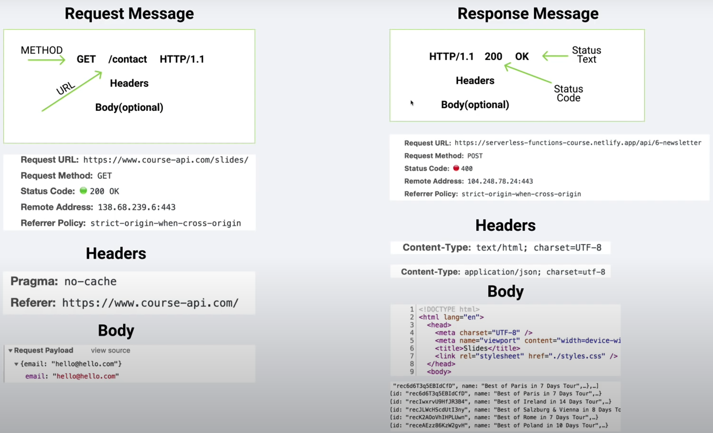
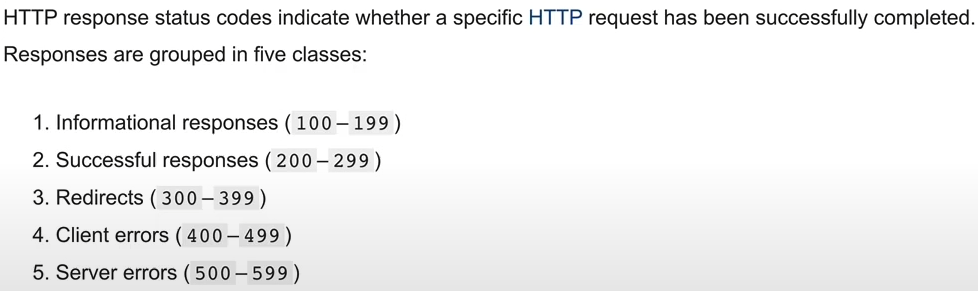
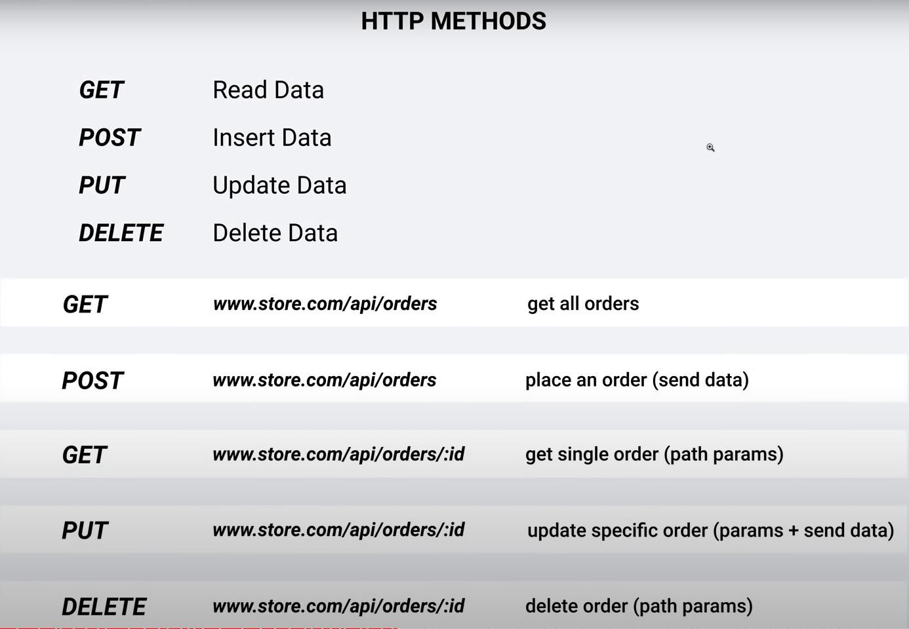
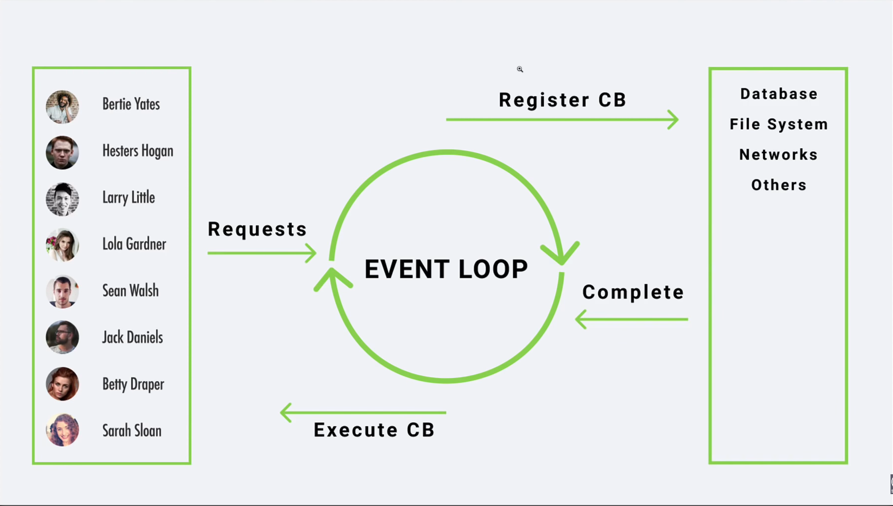

# **_Node Js & Express Js_**

Node Js allow us to run Js Code outside the browser, it was build on chrome's V8 Js Engine (Tool that compiles our code into machine code!), and also let us create secure, functional and escalable _FullStack Web Applications_ way easier!<br>

---

<br>

### **Requirements**

<br>
Basic Understandin on:

~ Html.<br>
~ Css.<br>
~ Js: ES6.<br>

- Callbacks.<br>
- Promises.<br>
- Asynd-Await.<br>

<br><br>

### **What You Will Learn**

<br>

~ Node fundamentals.<br>

- Complex Rest API
- Mern App
- Projects.

~ Express Js.<br>
~ mongoDB.<br>
~ Mongoose.<br>
~ Aplicaitons.<br>
~ Deployment.<br>

<br>

---

<br>

## **~ Introduction**

<br><br>

Differences between Browser's and Node Js

| Browser          | Node Js          |
| ---------------- | ---------------- |
| DOM              | No DOM           |
| Window           | No Window        |
| Interactive Apps | Server Side Apps |
| No Filesystem    | Filesystem       |
| Fragmentation    | Versions         |
| ES6 Modules      | Common Js        |

<br>

### **Install Node Js**

<br>

Navidate to [NodeJs](https://nodejs.org/en/) and download the LTD version (Long Term Support).

Once installed, check in your terminal with the command **node --version** to check the version and verify everything is correct!

<br>

### **How do we get Node to evaluate our code?**

<br><br>

#### **REPL (Read-Eval-Print Loop)**

<br>

It bassicaly takes the user inputs, executes them and returns the result to the user.

<br>

**_How can we use REPL?_**

~ We have to type **node** and hit enter, the we will have an angle bracker **>**, this means we are inside the REPL.

```typescript
PC C: something> node
> const success = 1;
> success
1
```

To exit the REPL just hit **CTRL + C** \* 2

<br>

#### **CLI (Command Line Interface)**

<br>

Allows the user to respond to visual prompts by typing single commands into the interface and receiving a reply in the same way.

<br>

So instead of writting our code inside the terminal, we can run a serious Node application typing **node + filePath** and it'll handle everything!

```typescript
PC C: something> node app.js
```

<br>

#### **Which one should I choose?**

<br>

REPL is often used to starters and playing around, CLI is used for everything else, for beginners, playing around on REPL is perfect, but, for mastering your skills, CLI will do the job!

<br><br>

## **~ Node Fundamentals**

<br> <br>

### **GLobals**

<br>

No matter where we are in the application, we can always access these variables.

Some variables:

~ \_\_dirname: Path to current directory.<br>
~ \_\_filename - file name.<br>
~ require - function to use modeules (CommonJs).<br>
~ module - info about current module (file).<br>
~ process - info about environment where the program is being executed.

<br>

### **Modules (Encapsulated code)**

<br>

As we are only calling one file it's extremly complex to writte and entire app in just one file, so we have to split it on modules!

Every file is a module by default, so after creating a new file with our needed code we can export what we only need by using **module.exports** and setting it to an object with the varibales we want to share!

```javascript
// local
const secret = "secret";

// shared
const hello = "Hi, How are you!?";
const bye = "Bye, Nice to meet you!";

// exports
module.exports = { hello, bye };
```

On the main file, we can import this information by using **require**!

```javascript
// imports
const phrases = require("./filepath");

~ Notice inside the require parenthesis we set the file path where we are exporting our data.
~ Now, 'phrases' has the object: {hello, bye}.

~ We can also destructure the object:
const { hello, bye } = require("./filepath");
```

<br>

#### **Alternative Flavor**

<br>

We can also export our code by:

```javascript
module.exports.items = [1, 2];

const device = {
  name: "kerboard",
};
module.exports.electronicDevice = device;
```

<br>

### **Mind Grenade**

<br>

Instead of setting out the modules, once we require a file without asign it to a variable it'll invoque what's inside the called file.

<br>

### **Built-In Modules**

<br>

Here are some of the most used Built-In Modules!
I'll briefly explain some of the uses and methods each module has, so don't think this is all we have!

<br>

#### **OS**

<br>

Provides many useful properties and methods for interacting with the operating system as well as the server.

<br>

_How to import?_

```javascript
const os = require("os");
```

_How to access it's methods and properties?_

```javascript
// Info about the current user
const user = os.userInfo();

// How long the computer has been running
const upTime = os.uptime();
```

<br>

#### **PATH**

<br>

Let's you interact with path's easily.

<br>

_How to import?_

```javascript
const path = require("path");
```

_How to access it's methods and properties?_

```javascript
// Get our actual path
const ourPath = path.sep();

// How to normalize path's
const filePath = path.join("/som/", "folder", "file.txt"); // it'll return '/som/folder/file.txt'

// Imagine we have a file.txt and we want to read what's inside of it
const base = path.basename(filePath); // Here we will get the text inside the file.

// So, you want an absolute path?
// Here we will set the same path to our file.txt we set on the 'filePath' variable
const absolutePath = path.resolve(__dirname, "som", "folde", "file.txt"); // Remember the global variables? __dirname will provide our current path and .resolve will join that path with the variables we pass
```

<br>

#### **FS (File System)**

<br>

There are two flavors when it comes to file module:

<br>

**_~ Sync (Blocking)_**

<br>

```javascript
// So, do you want to read and write a file?
// First, we implement FS by destructuring the readFileSync and writeFileSync!
const { readFileSync, writeFileSync } = require("fs");

// To get the data from a file we have to call the readFileSync function and set the parameters: 1. File path. & 2. Character encoding.
const dataFile = readFileSync("./folder/subfolder/file.txt", "utf8");

// To create or write on a file, we have to call the writeFileSync function and set the parameters: 1. File name. (If the file name doesn't exits, node will created automaticly) & 2. Data.
writeFileSync("./folder/subfolder/myFile.txt", "Hey, this is my file!");

// With only two parameters we are creating or overwriting the data inside selected file, but if we want to append it, we must pass an extra parameter: 3. append.
writeFileSync("./folder/subfolder/myFile.txt", "Hey, this is my file!", {
  flag: "a",
});
```

<br>

**_~ Async (Non-Blocking)_**

<br>

```javascript
// If we want to recreate the read and write methods from the Async examples, we now have to implement CallBacks!

// Instead of requiring Sync functions we now need to call Async functions!
const { readFile, writeFile } = require("fs");

// Now on the readFile we have a third parameter, the 'callback' function, which will tell us if the program failed or succeeded!
readFile("./myFile.txt", "utf8", (error, result) => {
  if (error) {
    console.log(error);
    return;
  }

  // The callback also apply on the writeFile function!
  writeFile(
    "./mySecondFile.txt",
    `Here is the result from the first file: ${result}`,
    (error, result) => {
      if (error) {
        console.log(error);
        return;
      }

      console.log("success!");
    }
  );
});
```

<br>

**_~ Sync Vs Async!_**

<br>

_Sync is a line-by-line reader that will be executing the code as it's reading it, this could have an impact on performance if we are working with several users and demanding tasks, creating death time for the user, waiting until the tasks from other users are done._

_Async is a background worker, it's not a line-by-line reader, so it could be doing more tasks while the async function is still running in the background, making the workflow a lot more consistent and fluid, decreasing the death time for the user._

<br>

#### **HTTP**

<br>

The server side AKA Http Module, allow us to create a web server!

Here we will take a brief examples on how to create a server as well as implementing methods to interact with the server.

<br>

_How to import?_

```javascript
const http = require("http");
```

_Now, How can we create a server?_

```javascript
const server = htpp.createServer((req, res) => {});

~ The request parameter returns an object with useful methods and variables from your server.
~ The response is what we are returning.
```

    The create method from the http ,module, is looking for a callback.

    ~ For good practices is commonly called the first parameter "req" for the request and the second parameter "res" for the response.

<br>

As we are creating our server, we need to set a port for the server to be listening to:

```javascript
server.listen(5000);

The port is completely arbitrary, you can choose whatever you want
```

<br>

Now, we are going to create a short example using the url as well as the write method from the response variable, it should look like this:

```javascript
const http = require("http");

const server = http.createServer((req, res) => {
  switch (req.url) {
    case "/":
      res.write("Welcome, hope you're getting fun");
      break;
    case "/about":
      res.write("You now discovered some of our history! Well done!");
      break;
    default:
      res.write(`<h1>Ohh...</h1>
    <p>We couldn't find the page you are looking for :(</p>
    <a href="/">Home</a>`);
      break;
  }
  res.end();
});

server.listen(5000);

~ Notice we extract the url by using a request method and also write on our web page by a response method!
~ Once we send back our response, we MUST end our conexion by using res.end().
~ Finally we set the port the server will listen to.
```

<br>

**How we exchange data over the internet?**

<br>

Once we search for a web application via url, we are actually calling a server to handle our request and send us back the response with the data we were asking for.

<br>

**Http Messages**

<br>
Structure:



~ Request messages is what the user is sending. <br>
~ Response messages is what the server is sending.

<br>

_Headers:_

They are just the meta information about our request and they are opcional.

```javascript
res.writeHead(200, { "content-type": "text/html" });
```

This _.writeHead_ will give the server extra information about the response we are sending, the first parameter corresponds to the status code, and the second parameter corresponds to an object that containt crusial information about whats being send.

**NOW WE CAN READ HTML FILES AND PASS THEM AS A PARAMETER FOR THE** **_.write() | .end()_** **FUNCTION FROM THE 'res' PARAMETER INSIDE THE CREATE SERVER FUNCTION**

**Status Code**

There are plenty of status codes related to sending, handling and recieving data



[want more info!?](https://developer.mozilla.org/en-US/docs/Web/HTTP/Status)
<br>

**content-type**

Over the content type we need to cover what's going to be sent to the user, we need to specify what kind of information we are sending, for example, if we are sending an entire page on Html we must set the value as "text/html", 'text/' will mostly be on every value, what does change is the after slash content, this may differ on Html, plain and more!

We need to take into account if we try to send an html code with a content-type of 'text/plain', this will not show the user what we might expect, it'll show exactly the code we wrote because we are sending 'plain' text!

<br>

_Body:_

If the user wants to add a resource on the server then the body comes handy, otherwise its not necessary(optional).

<br>

**Http Methods**

<br>



We can also retrieve what method is being used, by using the 'method' method from the 'req' parameter from the server!

```javascript
const method = req.method;
```

~ Remember always calle this method inside the callback of the server!

<br>

We have to remember not all of these configurations have to be made by the developer, we are just trying to understand what's happening behind the scenes, there are plenty of packages that makes the work for us!

---

<BR>

### **IMPORTANT**

Once we create our application, we need to set manually all of our paths, files, and more!
But there is one important thing to keep in mind, we know reading an HTML file with an FS module and printing it out with the response method of HTTP, we can easily see the information, but what does actually happens when we try to read a CSS file or a javascript file?

<br>

_Hint:<br>~ It will return a 404 error_

<br>

But why?

As the html file is requesting the css and the javascript files, we also need to handle its own paths, meaning we also need to create a validation for each file. terrifying

_But don't worry we will solve most of our problems with express!_

Here is a short example of a page with styling (css) and logic (javascript):

```javascript
// Import modules

const http = require("http");
const { readFileSync } = require("fs");

// Import files

const html = readFileSync("./index.html");
const javascript = readFileSync("./handler.js");
const css = readFileSync("./style.css");
const logo = readFileSync("./logo.svg");

// Server

http
  .createServer((req, res) => {
    switch (req.url) {
      case "/":
        res.writeHead(200, { "content-type": "text/html" });
        res.write(html);
        res.end();
        break;
      case "/handler.js":
        res.writeHead(200, { "content-type": "text/javascript" });
        res.write(javascript);
        res.end();
        break;
      case "/style.css":
        res.writeHead(200, { "content-type": "text/css" });
        res.write(css);
        res.end();
        break;
      case "/logo.svg":
        res.writeHead(200, { "content-type": "img/svg+xml" });
        res.write(logo);
        res.end();
        break;
      default:
        res.writeHead(404, { "content-type": "text/html" });
        res.write("<h1>Page not found!</h1> <br> <h1>404</h1>");
        res.end();
        break;
    }
  })
  .listen(5000);
```

**~ For png and jpg images just use 'text/png' or 'text/png' as the content-type value!**

<BR>

---

### **NPM (Node Package Manager)**

<br>

At this point, we are only familiar with our own modules and the node build-in ones, but we also have access to a big code store _"NPM"_.

NPM allows us to reuse our code for different projects and import code written from other developers to ease our project and we also could share our own solution with other developers!

<br>

_Want to see more?_

~ [NPM](https://www.npmjs.com/)

<br>

This containers of code are often called:

- Package,
- Dependecis.
- Modules.

<br>

There is no security control over npm, anyone could upload anything!

<br>

**_How to start using NPM?_**

<br>

Once we installed Node Js, we also installed NPM, so we can use it right away!

Here are some useful commands for downloading packages with npm in the terminal:

```
1. global comand

~ npm

2. Check version

~ npm --version

3. Local Dependency - Use packages on local projects

~ npm i <packageName>

4. Global Dependency - Use Packages on any proyect

~ npm install -g <packageName>

~ sudo npm install -g <páckageName> (Mac)


<!-- By default all the modules we installed, are stored in the "node_modules" folder -->


5. Package.json - Manifest file (Stores important info about project/package)

~ Manual approach (Create package.json in the root, create properties etc)

~ npm init (step by step, press enter to skip)

~ npm init -y (Everything default)


<!-- The package.json is crucial when it comes to sharing your project and working with other developers. -->

6. Dev Dependency

~ npm i <packageName> -D

~ npm i <packageName> --save-dev

<!-- We use DevDependecies for modules that help us develop our application, like testing packages, but as soon we upload our application we could get rid of them! -->

7. Unistall Packages

~ npm uninstall <packageName>
```

<br>

---

<br>

_how does a package.json looks like?_

```json
{
  "name": "VsCode",
  "version": "1.0.0",
  "description": "",
  "main": "app.js",
  "scripts": {
    "test": "echo \"Error: no test specified\" && exit 1"
  },
  "keywords": [],
  "author": "",
  "license": "ISC"
}
```

_now with dependencies_

```json
{
  "name": "VsCode",
  "version": "1.0.0",
  "description": "",
  "main": "app.js",
  "scripts": {
    "test": "echo \"Error: no test specified\" && exit 1"
  },
  "keywords": [],
  "author": "",
  "license": "ISC",
  "dependencies": {
    "lodash": "^4.17.21"
  },
  "devDependencies": {
    "nodemon": "^2.0.7"
  }
}
```

<br>

---

<br>

Just as we want to share our code, we must keep in mind we can't just upload the "node_modules" folder, so we have to create an ignore file for wherever we want to upload our project

<br>

For github we can create a .gitignore file that should look like this:

```
/node_modules
```

This way we are avoiding carrying our node_modules file.

<br>

_Now, you should be wondering, How can we get the modules back once we clone the project?_ <br>

_~ Once we cloned the project we only have to use the command:_

```
npm install
```

_This will install all the dependencies written inside the "package.json" file and set your project again_

<br>

**How can we create commands with npm?**

<br>

To create commands we need to create an object called "scripts" inside the 'package.json' file, declaring the name of the command and setting its function.

We are going to create and example, we will replace 'node app.js' command for the 'npm start' command:

```json
"scripts": {
  "start": "node app.js"
}
```

This is how the json should look like:

```json
{
  "name": "VsCode",
  "version": "1.0.0",
  "description": "",
  "main": "app.js",
  "scripts": {
    "test": "echo \"Error: no test specified\" && exit 1",
    "start": "node app.js"
  },
  "keywords": [],
  "author": "",
  "license": "ISC",
  "dependencies": {
    "lodash": "^4.17.21"
  },
  "devDependencies": {
    "nodemon": "^2.0.7"
  }
}
```

Notice the scripts object now contains the start command, allowing us to use:

```
npm start
```

instead of:

```
node app.js
```

<br>

**NPX**

<br>

Works as an alternative to installing global packages, years ago we had to install the create-react-app globally for our react projects, but as scape for the global install's, _NPX_ was created, so instead of installing globally a package you might use once, you can use _NPX_ and have it only for the project you're currently working on.
<br>

**_npm vs npx_**

Npm is a tool that use to install packages. Npx is a tool that use to execute packages. Packages used by npm are installed globally you have to care about pollution for the long term. Packages used by npx are not installed globally so you have to carefree for the pollution for the long term.

<br>

**package-lock.json**

<br>

All of our packages have a version, which means each time we share and build our application, the dependencies must be the same, if not, they might appear bugs, and even our application could crash; The solution is implementing the 'package-lock.json' file, this way the version of our packages will remain intact as we are working through clone's and new version's of the app unless it's changed.

<br>

### **Nodemon**

<br>

Nodemon is a utility that will monitor for any changes in your source and automatically restart your server. Perfect for development.

<br>

_How to install?_

```
npm i nodemon -D
```

_How to use?_

Now we only need to set a new command inside the 'package.json' file, we will named it "dev", but you can call it whatever you want!

```json
{
  "name": "VsCode",
  "version": "1.0.0",
  "description": "",
  "main": "app.js",
  "scripts": {
    "test": "echo \"Error: no test specified\" && exit 1",
    "start": "node app.js",
    "dev": "nodemon app.js"
  },
  "keywords": [],
  "author": "",
  "license": "ISC",
  "dependencies": {
    "lodash": "^4.17.21"
  },
  "devDependencies": {
    "nodemon": "^2.0.7"
  }
}
```

    Notice we set the 'dev' command to 'nodemon app.js', refering our app.js as the main file, this means each time we update the file, it will restart the server

Using nodemon will increase our productivity as well as easing the workflow

One thing to keep in mind is we can't use nodemon outside the commands, as we installed nodemon locally, we could only use it on our project via commands, but if we have a good amount of file we need to constantly check, we could install nodemon globally and check for the file we needed to a lot easier.

```
npm i nodemon -g
```

<br> <br>

## **~ Node Js Fundamentals for Express Js**

<br> <br>

Before creating server side applications with Express Js we need to cover some important topic in order to move on!

### **Event Loop**

<br>

It allows node js to perform non blocking I/O (Input/Output) operations - despite de fact that javascript is single-threaded - by offloading operations to the system kernel whenever is posible.

_Single-Threaded means it executes the code line by line_

<br>



<br>

_Example:_

```javascript
console.log("first");
setTimeOut(() => {
  console.log("second");
}, 0);
console.log("third");
```

The output will be:

```
first
third
second
```

All this happens because the setTimeOut is an asynchronous function, and will be offloaded, going at the end of the line, finishing its processes after everything else finished.

_~ Notice the setTimeOut is set to start after 0 seconds, but it doesn't really matter what the time is, as it is an asynchronous function it'll always be offloaded._

<br>

### **Async Patterns**

<br>

Once we start overcharging our application it'll affect the entire community(users) increasing the loading times, to avoid this we use asynchronous functions, but when we nest different asynchronous functions it gets messy and harder to read the code.

<br>

we will return to our example on the FileSystem build-in module where we read and wrote data on .txt files, but this time we will refactor it and also increase the readability in different manners.

<br>

**_~ Promises_**

```javascript
const { readFile, writeFile } = require("fs");

// Here we create a function that returns us a promise
const getText = (pathname) => {
  return new Promise((resolve, reject) => {
    readFile(pathname, "utf8", (err, data) => {
      if (err) reject(err);

      result(data);
    });
  });
};

// Now we just call the promise.
getText("./myFile.txt")
  .then((data) => {
    console.log(data);
  })
  .catch((error) => {
    console.log(error);
  });
```

<br>

**_~ Async & Await_**

Now, by using _async & await_ we can simplyfy even more the code and also make it more readable!

We can start by calling the Promise inside a method:

```javascript
const start = async () => {
  try {
    const text = await getText("./myFile.txt");
    console.log(text);
  } catch (error) {
    console.log(error);
  }
};
```

    ~ Notice we set "start" as an asynchronous function by writing 'async' before the parameter brackets.
    ~ We also use a try & catch statement to have control over the success and errors thrown by the Promise.
    ~ Once we call a Promise, we must write 'await' before calling the Promise, this will wait until the Promise returns the information.

<br>

**_~ alternatives_**

Once we now how to create Promises and use them, know we can implement easier methods.

<br>

_Util_

The node. js "util" module provides some functions to print formatted strings as well as some 'utility' functions that are helpful for debugging purposes.

One specyfic functionality of 'util' is that allow us to Promisify our functions:

```javascript
const { readFile, writeFile } = require("fs");
const util = require("util");
const readFilePromise = util.promisify(readFile);
const writeFilePromise = util.promisify(writeFile);

const start = async () => {
  try {
    const text = await readFilePromise("./myFile.txt", "utf8");
    await writeFilePromise("./myFileTest.txt", `${text} you are amazing!`);
    console.log(text);
  } catch (error) {
    console.log(error);
  }
};

start();
```

If you don't want to implement utils you can also use a 'fs' method called promises, which automatically will return a the functions as promises:

```javascript
const { readFile, writeFile } = require("fs").promises;
```

Now we can call the functions as promises with async & await and that should do the work!

<br>

<br>

### **Events**

<br>

**Event Driven Programming**

When working over our project we need to handle every event the user creates, like hovering an object, clicking a button and more, but, in browsaer apps those events are mostly external, this style of programming is called _Event Driven Programming_, this is easier to work with GUI's, but we can also handle events on the server side.

<br>

**Event Emitter**

Lets set up our own event s on Node!

```javascript
// Here we will import the Event Emiter module.
const EventEmitter = require("events");

// Here we will create a custom event by creating the instance of the class.
const customEmitter = new EventEmitter();
```

Now, we have to importants methods inside the instance we just created:

<br>

_on_

The **on** method asign an specific event for our EventEmitter instance.

```javascript
customEmitter.on("eventName", () => {
  console.log("hey! This is an event!");
});
```

We can have different events with under the same name but with different processes.

```javascript
customEmitter.on("eventName", () => {
  console.log("hey! This is another function for the same event!");
});
```

parameters:

1. name of the event.
2. function asigned for that specific event.

<br>

_emit_

The **emit** method acts as a trigger, so whenever you want the event to start, you call the **emit** function and that will do the job!

```javascript
customEmitter.emit("eventName");
```

parameters:

1. name of the event.

<br>

_We can also pass parameter for the events!_

```javascript
customEmitter.on("newEvent", (id, name) => {
  console.log(
    `The user ${id}: ${name} was successfully added to the database.`
  );
});

customEmitter.emit("newEvent", 911, "zerquiolin");
```

One thing to keep in mind is whenever you want to call an event, you have to be sure the emit method is under the on method because as working with a single-threaded language, it'll not recognize the emit of the event if it hasn't realized there is an event.

<br>

### **Streams**

<br>

Streams are often used to read or write sequentially, this help us on handling streaming data or a big file.

Streams also extends the EventEmitter class, so we can handle events as well!

<br>

we have different types of streams:

<br>

#### **readable**

A very good use case is using streams when we are reading a file, because either we use a synchronous or asynchronous approach we will have to store the data inside a variable and this will not always work, it actually depends on how much data is constained inside the actual file and how much data a variable can store.

The solution is **ReadStream** function from the FyleSyste module:

```javascript
// Import ReadStream by destructuring

const { createReadStream } = require("fs");

// Now we create an instance of the class with the path of the file as the parameter
const stream = createReadStream("./myFile.txt");

// Now we can handler different events like data and error
stream.on("data", (chunk) => {
  console.log(chunk);
});
```

    ~ Once we console log our result, if the the file is too big, the data will be retrieved in chuncks!

By default, each chunck is 64kb, nut if we want to expand that limit we can pass an object as a second argument of the instance which will also contains the code encoding:

```javascript
const stream = createReadStream("./myFile.txt", {
  highWaterMark: 90000,
  encoding: "utf8",
});
// highWaterMark sets the limit of each chunk
```

<br>

#### **_writeable_**

At this point we can retrieve information from a file with no problems, but what if we encounter a problem an the file cant be reached o something similar?

We now can use the _error_ event handler:

```javascript
stream.on("error", (error) => {
  console.log(error);
});
```

If we also want to write on the server, we dont necessarealy need the _write_ or the _end_ method from the response parameter of the server, we now as we are using _streams_ we can use the method _pipe_:

So, instead of writing:

```javascript
const http = require("http");
const { readFileSync } = require("fs");

http
  .createServer((req, res) => {
    const text = readFileSync("./myFile.txt", "utf8");

    res.write(text);
    res.end();
  })
  .listen(5000);
```

We could improve our codes efficiency and performance by using streams and its method pipes:

```javascript
const http = require("http");
const { createReadStream } = require("fs");

http
  .createServer((req, res) => {
    const fileStream = createReadStream("./myFile.txt", {
      highWaterMark: 90000,
      encoding: "utf8",
    });

    fileStream.on("open", () => {
      fileStream.pipe();
    });

    fileStream.on("error", (error) => {
      res.end(error);
    });
  })
  .listen(5000);
```

<br>

#### **Duplex**

<br>

    \_(-_-)_/

#### **Transform**

<br>

    \_(-_-)_/

<br> <br>

## **~ Express Js**

<br> <br>

Now lets make our lives easier!

Express is a minimal and flexible Node Js webapp framework, design to make developing websites (webapp) and apis much faster and easier.

Besides Express is not a built-in module in Node Js, its pretty much an standart when creating web applications with Node Js!

<br>

**How to install?**

Running on the terminal:

```
npm install express --save
```

    ~ The '--save' is because in the earlier Node versions once you installed Express it might not be saved on the 'Package.json', so the '--save' assures it's saved, nowadays this problem is gone, but just for precaution it's still used.

<br>

### **Express Basics**

Once we installed Express we can add its module:

```javascript
const express = require("express");
```

Now we can create our app:
(This is pretty much similar to the 'createServer' method from the http module, but here we dont need to pass in any parameters)

```javascript
const app = express();
```

Here is something cool! <br> Since we are importing a function via the 'express' import, we can chain the parentheses calling its function automatically

```javascript
const express = require("express")();
```

This way we import the module and create the app in one single line!

<br>

We have some pretty important methods:

1. Get - read data.
2. Post - insert data.
3. Put - update data.
4. Delete - delete data.
5. All - handle all http verbs
6. Use - sets the middleware
7. Listen - Sets the port.<br>

(we will cover them deeper on the course)<br>

Quick basic example:

```javascript
// import mddules

// Create an instance as well as evoking the function
const express = require("express")();

// Resolve requests

// on the 'get' method, the first parameter is the path and the second parameter is the callack with the reques and response parameters
express.get("/", (req, res) => {
  res.send("Home Page");
});
// the '.send' method will act as the '.write' method of the http module

// on the 'all' method, the first parameter is the path and the second parameter is the callack with the reques and response parameters
// if the request couldnt find the resource, by using this 'all' method we will handle the exception adn throw our own 404 error
express.all("*", (req, res) => {
  res.send("<h1>Path not found! :</h1>");
});
// keep in mind we set all the paths by using '*'

// on the 'listen' method, the first parameter is the port our app will be listening to and the second parameter is the callback with the processes we need to execute once the server is up
express.listen(5000, () => {
  console.log("The server is listening on port :5000");
});
```

Notice we didnt set any status code, hwo can we handle our errors, alerts, success and more?

~ We can chain the methods of the res variable.<br>
~ We will be using the 'status' method!

```javascript
res.status(200).send("We did it!");
```

This way we set a 200 status code for that response!

<br>

---

<br>

### **App Example:**

<br>

```javascript
// Import modules

// Since we are going to be using methods from the import as well as methods from the invoked instance
const express = require("express");
const app = express();

// We will import the path module as we need to send the absolute path for sending the file
const path = require("path");

// set the root file
app.get("/", (req, res) => {
  res.sendFile(path.join(__dirname, "./index.html"));
});
// we used the join method so set the absolute path but we can also use the .resolve() method
// we used the global variable '__dirname' to obtain the actual path

// Remember we had to set a path for each file we needed, no matter if it was css, javascript and more?
// with express we can set a folder with all the files and call them by using middleware
app.use(express.static("./assets"));
// .use() just set up the middleware
// .static() sets the static assets, we only pass the path of the folder
// This configuration automaticly handles all the status codes

// Here we will hanlde the unfound path and send the 404 error
app.all("*", (req, res) => {
  res.status(404).send("<h1>The path was not found!</h1>");
});

// setting the port...
app.listen(5000, () => {
  console.log("the server is listening on port :5000");
});

// static assets that dont change

// another way to execute our web app is setting the index.html to the assets folder where the .use() method is taking place, this will take the starting file index.html file and everything will work fine
```

~ **middleware** enables communication and data management for distributed applications.

<br>

---

<br>

### **API Vs SSR (Server Side Rendering)**

<br>

when it comes to express, in most cases you will use one of the following options:

<br>

| API        | SSR            |
| ---------- | -------------- |
| API - JSON | SSR - TEMPLATE |
| Send Data  | Send Template  |
| RES.JSON() | RES.RENDER()   |

<br>

Api is one of the most used terms used in the community, in express or http cases, when we talk about api we mean setting up an http interface to interact with our data, the data is send by using json (Javascript Object Notation), in order to send back our response we use, res.json(), this will handle the hard work like setting the right content-type and stringify our data.

server side rendering sets up templates and send back entire html, css and javascript files by using res.render()

when it comes to more complex express examples, we need to have no doubt which technology to use, whether its api or ssr, this lets us focus more on the problem itself and not overcomplicate ourselves

we will start using apis beacuse it'll help us to focus more on the actual express over templates, for begginers its a great choise!

<br>

**_Fetching JSON data_**

Once we make an http request, we can send data via .json() method, which will actually return the object to the user!

After creating our app and setting our path, we can send our json file:

```javascript
res.json([{ name: "zerquiolin", code: 911 }]);
```

And access by the url we previusly set up.

lets make a real example:

<br>

Data.js:

```javascript
const products = [
  {
    code: 1,
    name: "milk",
    price: 9.99,
  },
  {
    code: 2,
    name: "cookies",
    price: 5.99,
  },
];

module.exports = { products };
```

App.js

```javascript
// import modules

const express = require("express")();
const { products } = require("./Data.js");

express.get("/", (req, res) => {
  res.json(products);
});

// imagine you only need the first two parameters of the json, we can destructure the data
express.get("/", (req, res) => {
  const newProducts = products.map((element) => {
    let { code, name } = element;
    return { code, name };
  });
  res.json(newProducts);
});

express.listen(5000);
```

<br>

### **_Route Params_**

Imagine we are building an ecomerce, we must have a single page for each product, now imagine we have over 1000 products and for each product we need to create a path and handle its logic...Thats a lot!

Thankfuly route params exists, which are variables inside the url, but how do they work?

Once we set our path we use a colon and set the variable name, for example:

```
/store/:productId
```

~ our variable in this case will be 'productId', but where is stored?

By console logging the req parameter and looking up for an object called 'params', we will encounter where our route variables are being stored!

~ Now we know where are our path variables being stored, but how can we access them?

```javascript
// inside the get method from express we can get access to the req parameter

// we can obtain the value by accessing the variable:
req.params.productId;
// or we can access the variable by destructuring the object:
const { productId } = req.params;
```

<br>

---

**¡¡WE MUST TAKE INTO ACCOUNT EVERY VALUE STORED ON THE 'PARAMS' OBJECT WILL BE STORED AS A STRING!!**

---

<br>

Lets meake a quick example where we console log the value the user inserts on the url:

```javascript
// import modules
const express = require("express")();

express.get("/:userValue", (req, res) => {
  res.send(req.params.userValue);
});

express.listen(5000);
```

This means if we set the url as **http://localhost:5000/test** the value that will be shown on the screen will be **test**!

<br>

And yeah! We can create more variables on a single path, lets make an example:

```javascript
// import modules
const express = require("express")();

express.get("/home/:userValue/store/:productId", (req, res) => {
  const { userValue, productId } = req.params;
  res
    .status(200)
    .send(`~ userValue: ${userValue} <br> ~ productId: ${productId}`);
});

express.listen(5000);
```

Here we have two path variables:

- userValue
- productId

This means using this input:

    http://localhost:5000/home/zerquiolin/store/911

We will get this output:

    ~ userValue: zerquiolin
    ~ productId: 911

<br>

### **Query Strings or Url Strings**

They are often used to send a small amount of information to the server using the url, this information is usually used as parameters for query databases or filter results!

This works very similar to _Route Params_, we send variables via url and an object called 'query' catches them.

Whatever is after the question mark is no considered part of the url, is just the parameters we are sending!

_How does it work?_

Its syntax is setting a question mark '?' after the folder we are currently on, and then set the variables we want to send and they will be stored into an object called the same as the folder we are sendng our variables, this means if we set an url like this:

```javascript
"/home/store/api";
```

All the variables the user or the server sends will be stored on a variable called 'api'!

Now, how can we send some varibles?

```javascript
// after the question mark '?' we send our variables by sending the variable name and its value
// we can send various variables by separing them with a the symbol '&'

"/home/store/api?limit=2&lenght=3";
```

Here we have two variables:

1. limit with a value of 2.
2. lenght with a value of 3.

<br>

**WE HAVE TO KEEP IN MIND EACH OF THE VALUES WE SEND, ARE SENT ND STORED AS STRINGS!**

<br>

And just as the route params we can access the variables by calling an destructuring the object:

```javascript
// Remember the url we are requesting is:
// /home/store/api?limit=2&lenght=3
express.get("/home/store/api", (req, res) => {
  const { limit, lenght } = req.api;
  res.send(`Limit: ${limit} <br> Lenght: ${lenght}`);
});
```

<br><br>

---

<br>

### **_IMPORTANT_**

<br>

We cant send more than 1 response for a request, otherwise we are going to get an error and express will be confused at sending the responses!

<br>

---

<br> <br>

### **Middleware Setup**

<br>

_Express middleware are functions that executes during the request of the server, each of the middleware functions has access to the request and response objects, and its functionality is limitless!_

Middleware is everywhere in express js!

This is one of the most important topics of express js!

How is the order of execution?

~ request => middleware => response

What middleware does is stays in between, the request comes in, then we do some kind of functionality and then send the response!

Now, we might have to use the same functionality on different request, but how can we do that?

```javascript
const express = require("express");
const app = express();

const logger = (req, res, next) => {
  // Some pretty dang logic in here!

  next();
};
// We always MUST continue with the next middleware by invoking the next function or just send a response
// if we dont send a response or continue to the next middleware the web app will enter a loop cicle and won't load up

// inside the get function we have another parameter, u guest it! the middleware, so now we have the path, the middleware and finaly the callback!
app.get("/", logger, (req, res) => {
  res.send("We did it!");
});
// dont worry about sending the parameters to our middleware function, express will automatically handle it!

app.listen(5000);
```

One additional functionality is when your trying to set more than 1 middleware for a single path, instead of passing the one by one you just can send an array of middleware functions and that will do the job!

```javascript
app.get("/", [middlewareFunction0, middlewareFunction1], (req, res) => {
  // code
});
```

<br>

### **App.use()**

Once we start to have more and more routes it will become harder to manually set the middleware to each of them, the solution is setting the middleware function on sepparate file and import it via modules, onces we want to apply the middleware function we just imported, we set:

```javascript
// logger.js contains our middleware function
const logger = require("./logger.js");

// express
const express = require("express");
const app = express();

// setting the middlware function to each of the routs we create
app.use(logger);
```

now you should be wondering how are we applying our logger function to each of the routs we create, the answer is simple, as JavaScript is a single-threaded lenguage everything thats below our app.use() will automaticly inherit our middleware!

Keep in mind if we have:

```javascript
app.get("/", (req, res) => {
  // CODE
});

app.use(logger);

app.get("/home", (req, res) => {
  // CODE
});
```

The only path that will inherit our middleware will be the '/home' path as the '/' path was already read!

<br>

we also could asign paths to our app.use()!

for example:

```javascript
app.use("/home", logger);
```

As we asign '/home' as our entry path for the logger, we are taking that each path we create that extends the home folder will also have the middleware.

    path examples:

    '/home/store'
    '/home/api'
    '/home/aboutus/contactus/'

    each of these routs will have the middleware

<br>

### **Multiple Middleware Functions**

Once you have different middleware functions (hopefuly on a different file), we can set multiple functions to the app.use() method:

```javascript
// both logger.js and active.js are middleware functions
const logger = require("./logger.js");
const active = require("./active.js");

// express
const express = require("express");
const app = express();

// setting the middlware function to each of the routs we create
app.use([logger, active]);
// here you have to keep in mind the app.use() works in order, so it'll execute one function after the other based on the order we passed in
```

we also have to keep in mind there are tree ways of getting middleware functions:

1. selfmade
2. express made
3. third party made
   - One good example is [Morgan NPM](https://www.npmjs.com/package/morgan)

<br>

A pretty import thing is asignning new variables to the request object on the middleware function just to be used later on the response!

For example:

```javascript
// import modules
const express = require("express");
const app = express();

// middleware functions
const data = (req, res, next) => {
  req.newData = {req.method, req.url, new Date().getFullYear()};
  next();
};

// web app
app.get("/", data, (req, res) => {
  app.send(req.newData);
});
// Notice we now can access the object inside the request we previuosly created on the middleware function!

app.listen(5000);
```

<br>

### **Http Methods Examples And Uses**

<br>

#### **Get Method**

The Get method is the default method for requesting information, is used for reading the data.

Quick example:

We have an object called 'data' inside the Data.js file:

```javascript
const data = [
  {
    id: 1,
    name: "mobile",
  },
  {
    id: 2,
    name: "laptop",
  },
  {
    id: 3,
    name: "pc",
  },
];

module.exports = data;
```

Now, in our app.js file:

```javascript
// import modules
const express = require("express");
const app = express();
const data = require("./Data.js");
// web app

app.get("/api/data", (req, res) => {
  res.status(200).json(data);
});

app.listen(5000);
```

With this example we now can visualice and fetch our data

<br>

#### **Post Method**

The Post method is used to send information!

We have to understand we must send crusial information when using and html form, once we set our inputs or the tag that will send our information, we have to gave them at least a name, because with this information we are going to identify them and get their values a lot easier, this is just adding the 'body', something its not a must on the get method:

How can we use post?
~ it actually works pretty similar to get, lets make a quick example:

```javascript
// import modules
const express = require("express");
const app = express();
// web app

app.get("/api/data", (req, res) => {
  res.status(200).json(data);
});

app.post("/api/data", (req, res) => {
  // CODE
});

// Notice we have the same url but different http methods, is this correct?
// Just because we have the same path doesnt mean we are executing the same functionality, this could be used for fetching and sending data on the same url

app.listen(5000);
```

We only have set the common structure for the post method, but how can we retrieve the data now?

Once we send our post with the html form the data will be sent but not stored yet, for us to access and store the data we have to parse the information and with a method of the express module we can add the data to the request parameter as the body object.

```javascript
// parse the data
app.use(express.urlencoded({extended: false}));
// urlencoded is just an express middleware function that allow us to parse the informacion and add the data to the request parameter
// the extended property just allow us to parse the data with queryStringLibrary

// now as we just encode the data we can access the data with no problem
app.post("/api/data", (req, res) => {
  res.status(200).json(req.body);
/});
// we now can visualize the data that has been sent on the html form!
```

And there is another way to send information, there is a library called AXIOS which will allow you to handle better the errors and also be mor capable to send and retrieve information due to its ease

but there is an important thing to keep in mind as we use axios, because it sends the informacion as json objects, so we have to handle them to access the information with any problems.

Its actually easy, we just need to set a middleware function by using the .use() method and accessing an express method called .json() which will parse the data so we can use it!

```javascript
app.use(express.json());
```

<br> <br>

---

<br>

### **IMPORTANT**

Once we are more into testing our web app, we can download **Postman**, this application will help us handling http methods easier, with an intuitive UI that which will help us debbug our request and response handling!

[**Postman**](https://www.postman.com/)
<br>

---

<br><br>

### **Put Method & Delete Method**

As you can notice, each of the http are pretty similar, their structure and how they work is pretty similar!
In this casem the put and delete method work just as fine as the get method, nevertheless, they are so important to identify whats being done in the code!

<br>

### **Express Router**

Once we start to grow our application, we will encounter we are constantly repeating url paths, something like this:

```javascript
"/api/data";
"/api/data";
"/api/data/filter";
"/api/data/:id";
"/api/data/:Id";
```

Notice we have the same '/ape/data' path, so we are repeatng ourselves and making the code harder to read!

But there is a solution for that _Express Route_, this will allow you to sepparate the request that have the same path on a separate file, lets make a quick example:

Imagine we have this app.js file:

```javascript
// import modules
const express = require("express");
const app = express();

// web app
app.get("/api/data", (req, res) => {
  /* CODE */
});
app.post("/api/data", (req, res) => {
  /* CODE */
});
app.get("/api/data/filter", (req, res) => {
  /* CODE */
});
app.put("/api/data/:id", (req, res) => {
  /* CODE */
});
app.delete("/api/data/:id", (req, res) => {
  /* CODE */
});

app.listen(5000);
```

We basicaly have a starting path '/api/data' thats repeated on each path, we could do something pretty cool, by using express router we can set all this methods on a sepparate file:

lets call this new file **Data.js**:

```javascript
// import modules
const express = require("express");
const router = express.Router();

// notice all our app. where changed to router.
router.get("/api/data", (req, res) => {
  /* CODE */
});
router.post("/api/data", (req, res) => {
  /* CODE */
});
router.get("/api/data/filter", (req, res) => {
  /* CODE */
});
router.put("/api/data/:id", (req, res) => {
  /* CODE */
});
router.delete("/api/data/:id", (req, res) => {
  /* CODE */
});

// finally we export our router
module.exports = router;
```

Now, as we have all our methods on a sepparate file we can refactor our **App.js** file:

```javascript
// import modules
const express = require("express");
const app = express();

// import our express route we just created
const data = require("./Data");

// for the app to work we need to implement the .use() method and set the base folder as well as the router we just created
app.use("/api/data", data);
// we now succesfuly refactor our code and made it more readable, and accesible!

app.listen(5000);
```

Did you notice something?
As we already set our base folder on the .use() method for our router, our paths on the **Data.js** have to change, because our base is no longer '/' its '/api/data'

**Data.js**:

```javascript
// import modules
const express = require("express");
const router = express.Router();

// As our base folder is now '/api/data' we could asign the paths of our methods to folders within that base.

// notice all our app. where changed to router.
router.get("/", (req, res) => {
  /* CODE */
});
router.post("/", (req, res) => {
  /* CODE */
});
router.get("/filter", (req, res) => {
  /* CODE */
});
router.put("/:id", (req, res) => {
  /* CODE */
});
router.delete("/:id", (req, res) => {
  /* CODE */
});

// finally we export our router
module.exports = router;
```

Another thing we could to do to increse the readability of the code is set the callback functions on a different file:

**Callbacks.js**

```javascript
const getData = (req, res) => {
  /* CODE */
});

const postData = (req, res) => {
  /* CODE */
});

const getFilteredData = (req, res) => {
  /* CODE */
});

const putData = (req, res) => {
  /* CODE */
});

const deleteData = (req, res) => {
  /* CODE */
});

module.exports = {getData, postData, getFilteredData, putData, deleteData}
```

Now lets import and refactor our **Data.js**:

```javascript
// import modules
const express = require("express");
const router = express.Router();

// import callback functions
const {
  getData,
  postData,
  getFilteredData,
  putData,
  deleteData,
} = require("Callbacks.js");

// As our base folder is now '/api/data' we could asign the paths of our methods to folders within that base.

// notice all our app. where changed to router.
router.get("/", getData);
router.post("/", postData);
router.get("/filter", getFilteredData);
router.put("/:id", putData);
router.delete("/:id", deleteData);

// Now we have a much cleaner code!!!

// finally we export our router
module.exports = router;
```

<br>

#### **Express Route**

As we saw on the Express Router example we could extract a base folder and work with different files, increasing the readability as well as the structure of the proyect, but we can improve our app even more!

Lets continue the Express Router example with the same files, so lets head into **Data.js**:

```javascript
// import modules
const express = require("express");
const router = express.Router();

// import callback functions
const {
  getData,
  postData,
  getFilteredData,
  putData,
  deleteData,
} = require("Callbacks.js");

router.get("/", getData);
router.post("/", postData);
router.get("/filter", getFilteredData);
router.put("/:id", putData);
router.delete("/:id", deleteData);

module.exports = router;
```

Notice even thought we made a base folder and reduce our paths we still have some repeated ones, we can use the route method of router to simplify even more everything!

```javascript
// import modules
const express = require("express");
const router = express.Router();

// import callback functions
const {
  getData,
  postData,
  getFilteredData,
  putData,
  deleteData,
} = require("Callbacks.js");

// Once we set up our route we can chain our htto method passing the callback only!
router.route("/").get(getData).post(postData);
router.route("/filter").get(getFilteredData);
router.route("/:id").get(putData).post(deleteData);

// We finish our refactor and set a better strucutre and a much more readable code!

module.exports = router;
```

<br>

# **_CONGRATULATIONS!_**

### We just got to the end of our course, we did great, hope seeing you around soon!
